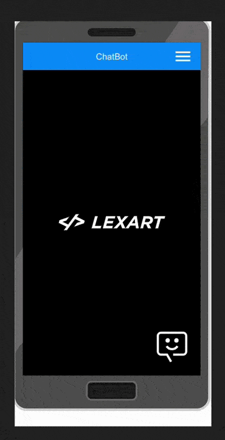

# LexArt Labs chatboot
In this project was created a chatboot to complete the LexArt Labs fullstack test. 


## Installation

Start MySql docker container

```bash
  docker container run --name container-mysql -e MYSQL_ROOT_PASSWORD=password -d -p 3002:3306 mysql:8.0.29
```

Clone the project

```bash
  git clone git@github.com:luizlacerdam/chatbot-lexart-labs.git
```

go to project back-end repo

```bash
  cd chatbot-lexart-labs/back-end
```

Install dependencies

```bash
  npm install
```

Migrate db

```bash
  npm run db:reset
```

Start back-end

```bash
  npm run dev
```

go to project front-end repo

```bash
  cd ../front-end
```

Install dependencies

```bash
  npm install
```


Start front-end

```bash
  cd ../front-end
```

```bash
  npm run dev
```


## Usage/Examples

```javascript
import Component from 'my-project'

function App() {
  return <Component />
}
```


## Features

- It can interpret the terms: "Hello", "Goodbye", "Good", "I want" to initiate a conversation thread with the user.
- It requires a username and password to continue the conversation.
- Upon encountering the term "loan", it displays three options: "Do you want to apply for a loan?", "Loan conditions", and "Help".
- Clicking on the options displays relevant information with a link for reference.
- When the user enters the term "Goodbye", the conversation is finished and stored in a database.
- There is a page to export the historic conversations in CSV order by date.


## Demo


